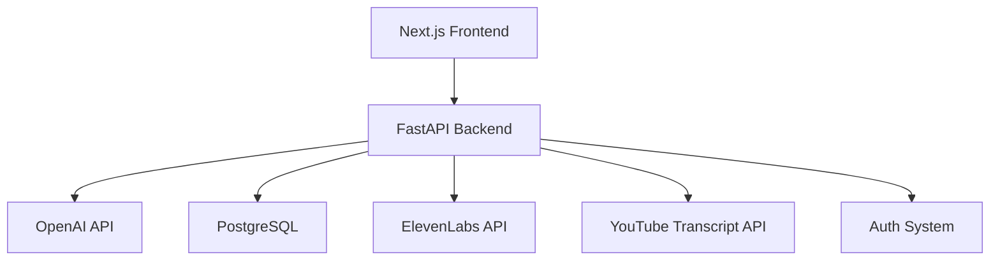

<h1 align="center">🧠 SmartHub</h1>

<p align="center">
  <b>AI-Powered Learning & Knowledge Transformation Platform</b>
</p>

<p align="center">
  Turn any video, document, or note into structured knowledge, smart summaries, quizzes, and audio lessons.
</p>

<p align="center">
  
  
  
  
  
  
</p>

---

## 🚀 Overview

SmartHub is an AI-powered learning platform that transforms unstructured content into structured knowledge, summaries, quizzes, and audio learning experiences.

Think of it as a personal AI learning system that helps you learn faster, retain more, and revise smarter — no matter what format your source material comes in.

**SmartHub processes:**

- 🎥 YouTube videos
- 📄 PDF documents
- 📝 Text notes
- 🎙️ Audio notes

**…and converts them into:**

- 📚 Structured study notes
- ✨ Smart summaries
- 🎯 AI-generated quizzes
- 🎧 Audio learning content

---

## ✨ Features

### 📄 Knowledge Processing Engine
Convert raw content into structured learning material.
- YouTube video → structured notes
- PDF → summarized learning content
- Text notes → organized study material
- Audio notes → transcription & summary

### 🧠 AI Learning System
- Smart, context-aware summaries
- Key concept extraction
- Topic breakdown into structured learning paths

### 🎯 Quiz Generation Engine
- MCQ generation from any content
- Short-answer questions
- Active recall-based quizzes
- Difficulty-based question levels

### 🎧 Audio Learning System
- Text-to-speech conversion
- PDF-to-audio summaries
- Notes-to-audio learning format (powered by ElevenLabs)

### 💬 AI Learning Assistant
- Chat directly with your study material
- Ask context-based questions
- Get concepts explained in simple terms

### 🎥 YouTube Learning Analyzer
- Extract video transcripts
- Analyze relevance to your learning topic
- Measure content depth & accuracy
- Get a recommended learning quality score

### 📁 Export System
- Download structured PDFs
- Save quizzes and notes
- Store learning history for revision

---

## 🏗 Architecture



---

## 🧰 Tech Stack

| Layer | Technologies |
|---|---|
| **Backend** | Python, FastAPI, PostgreSQL, SQLAlchemy (Async) |
| **Frontend** | Next.js, TypeScript, Tailwind CSS |
| **AI & Integrations** | OpenAI API, ElevenLabs API, YouTube Transcript API |
| **DevOps** | Docker, Docker Compose |

---

## 🚀 Getting Started

### 1. Clone the repository

```bash
git clone https://github.com/your-username/smarthub.git
cd smarthub
```

### 2. Set up environment variables

Create a `.env` file in the project root:

```env
DATABASE_URL=
OPENAI_API_KEY=
ELEVENLABS_API_KEY=

JWT_SECRET=
YOUTUBE_API_KEY=
```

### 3. Run the project

```bash
docker compose up --build
```

The app should now be running locally via Docker.

---

## 📊 How It Works

1. User logs in to SmartHub
2. Selects input type — YouTube / PDF / Notes / Audio
3. System processes and extracts information
4. AI converts it into structured knowledge
5. User generates notes, quizzes, or audio summaries
6. User saves or downloads the content

---

## 🎯 Core Learning Pipelines

**📄 Knowledge Pipeline**
`Raw Content → AI Processing → Structured Notes`

**🧠 Active Recall Pipeline**
`Notes → AI Quiz Generator → Practice Questions`

**🎧 Audio Learning Pipeline**
`Text/PDF → ElevenLabs → Audio Learning Content`

**🎥 Video Learning Pipeline**
`YouTube → Transcript → Analysis → Structured Study Material`

---

## 🚧 Roadmap

- [x] YouTube to notes system
- [x] PDF summarization
- [x] AI quiz generation
- [x] Audio learning system
- [ ] Spaced repetition system
- [ ] Flashcard engine
- [ ] Learning streak tracking
- [ ] Mobile app
- [ ] Collaboration study rooms
- [ ] Chrome extension for YouTube learning

---

## 📂 Project Structure

```
smarthub/
├── backend/      # FastAPI app, routers, services, models
├── frontend/      # Next.js + TypeScript app
├── services/      # AI, audio, and transcript service integrations
├── docker/        # Dockerfiles and compose configs
├── assets/        # Images and screenshots used in docs
└── README.md
```

---

## 💡 Why SmartHub?

SmartHub helps you:

- 🚀 Learn faster from any type of content
- 🔄 Convert passive content into active learning
- 🧠 Improve retention with quizzes
- 🎧 Study hands-free using audio learning
- 🗂️ Organize knowledge in a structured format

It's a complete AI-powered learning system, built for modern learners.

---

## 📜 License

This project is licensed under the **MIT License**.

---

## 📫 Contact

- **LinkedIn:** [Ibad Ur Rehman Rajput](https://www.linkedin.com/in/ibad-ur-rehman-rajput-69554433b/)
- **Email:** ahmedibad0012@gmail.com
- **Portfolio:** [ibadrajputportfolio.netlify.app](https://ibadrajputportfolio.netlify.app/)

---

<p align="center">
  ⭐ If you find SmartHub useful, consider giving the repo a star — it helps a lot!
</p>
